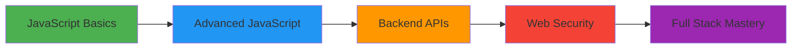

<div align="center">

<!-- Animated Header Banner -->


<!-- Typing Animation -->
<a href="https://git.io/typing-svg"></a>

<br/>

<!-- Animated Badges -->
<p>
  
  
  
</p>

</div>

---

## 🚀 About Me

```javascript
const ankush = {
    location: "Pune, Maharashtra 🇮🇳",
    education: "B.Tech in CSE (AI) @ ADYPU",
    currentFocus: ["Advanced JavaScript", "Backend APIs", "Web Security"],
    interests: ["Full-Stack Development", "Cybersecurity", "AI/ML"],
    askMeAbout: ["Web Dev", "Data Structures", "Security", "AI"],
    funFact: "I debug with console.log() and I'm proud of it!
    My Personal Website - https://profound-muffin-4b3660.netlify.app/🐛"
};
```

<div align="center">

### 💭 *"Code is like humor. When you have to explain it, it's bad."* – Cory House

</div>

---

## 🛠️ Tech Arsenal

<div align="center">

### Frontend Development
<p>
  
  
  
</p>

### Backend Development
<p>
  
  
</p>

### Programming Languages
<p>
  
  
</p>

### Database & Tools
<p>
  
  
  
</p>

### Specializations
<p>
  
  
  
</p>

</div>

---

## 🎯 Featured Projects

<div align="center">

<table>
<tr>
<td width="50%">

### 🏥 Smart Health Tracker
**Full-Stack Health Monitoring System**


📊 Comprehensive health score calculation  
💓 Tracks BMI, sleep, steps & heart rate  
🔒 Secure user data management  
📱 Responsive & intuitive UI

</td>
<td width="50%">

### 🤖 AI Doctor
**Intelligent Symptom Checker**


🩺 AI-driven health diagnostics  
💡 Symptom-based condition suggestions  
🎯 Smart pattern recognition  
⚡ Fast & accurate predictions

</td>
</tr>

<tr>
<td width="50%">

### 📝 Notes App
**Smart Notes Management**


✍️ Create, edit & delete notes  
💾 Persistent local storage  
🎨 Clean & minimal interface  
⚡ Lightning-fast performance

</td>
<td width="50%">

### 🥁 Drum Kit
**Interactive Music Experience**


🎹 Keyboard-triggered sound events  
🎵 Multiple drum sound samples  
🖱️ Mouse & keyboard support  
✨ Engaging visual feedback

</td>
</tr>
</table>

</div>

---

## 📊 GitHub Analytics

<div align="center">
  
  
</div>

<div align="center">
  
</div>

<div align="center">
  
</div>

---

## 🏆 GitHub Trophies

<div align="center">
  
</div>

---

## 🌱 Current Learning Path

<div align="center">



</div>

**🎯 2024-25 Focus Areas:**
- 🔥 Mastering Async JavaScript & Promises
- 🌐 Building RESTful APIs with Express
- 🔐 Implementing Authentication & Authorization
- 🛡️ Web Application Security Best Practices
- 🤖 Integrating AI/ML into Web Applications

---

## 🤝 Let's Connect!

<div align="center">

<p>
  <a href="mailto:ankushkumarake1234@gmail.com">
    
  </a>
  <a href="https://linkedin.com/in/ankush-kumar-60333537b">
    
  </a>
  <a href="https://github.com/ankushkumarake1234-lang">
    
  </a>
</p>

### 💌 Open for collaborations and opportunities!

<p>
  <a href=https://profound-muffin-4b3660.netlify.app/>My Personal Website</a>
</p>

</div>

---

<div align="center">

### ⚡ Fun Fact


</div>

---

<div align="center">

### 🐍 Contribution Graph

<picture>
  <source media="(prefers-color-scheme: dark)" srcset="https://raw.githubusercontent.com/ankushkumarake1234-lang/ankushkumarake1234-lang/output/github-contribution-grid-snake-dark.svg">
  <source media="(prefers-color-scheme: light)" srcset="https://raw.githubusercontent.com/ankushkumarake1234-lang/ankushkumarake1234-lang/output/github-contribution-grid-snake.svg">
  
</picture>

</div>

---

<div align="center">

### 📈 Contribution Calendar


</div>

---

<div align="center">

**⭐️ From [Ankush Kumar](https://github.com/ankushkumarake1234-lang) | 💜 Built with passion**


</div>
