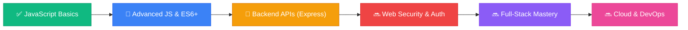

<!-- ═══════════════════════════════════════════════════════════ -->
<!-- ░░░░░░░░░░░░░░░░ ANIMATED HEADER BANNER ░░░░░░░░░░░░░░░░░ -->
<!-- ═══════════════════════════════════════════════════════════ -->

<!-- Typing SVG Animation -->

 

<!-- Profile Visitors + Stars -->

  
  
  

<!-- ═══════════════════════════════════════════════════════════ -->
<!-- ░░░░░░░░░░░░░░░░░░░ ABOUT ME SECTION ░░░░░░░░░░░░░░░░░░░ -->
<!-- ═══════════════════════════════════════════════════════════ -->

##  Hello, World! I'm Ankush Kumar

> **🎓 B.Tech in Computer Science & Engineering (AI Specialization) — 2nd Year**  
> **🏫 Vedam School of Technology, Pune, Maharashtra, India**  
> **🔗 Affiliated with Ajeenkya DY Patil University (ADYPU)**

I'm a passionate and driven developer who loves building **full-stack web applications**, exploring **artificial intelligence & machine learning**, and diving deep into **cybersecurity**. I believe in writing clean, efficient code and creating digital experiences that truly make a difference.

<table>
<tr>
<td width="50%" valign="top">

### 🧑‍💻 Quick Snapshot

- 🔭 **Currently Working On:** [AI Resume Analyzer](https://github.com/ankushkumarake1234-lang) & AI-driven apps
- 🌱 **Currently Learning:** Advanced JavaScript, RESTful APIs, Web Security
- 🤖 **Exploring:** AI/ML integration in web platforms
- 🎯 **2025–26 Goal:** Contribute to impactful open-source projects
- 💬 **Ask Me About:** Web Dev, DSA, Cybersecurity, AI
- ⚡ **Fun Fact:** I debug with `console.log()` and I'm proud of it! 🐛

</td>
<td width="50%" valign="top">

### 🎯 Vision & Goals

- 🚀 Become a **professional software engineer** at a leading tech company
- 🌍 Build products that **solve real-world problems**
- 🤝 Actively **contribute to open-source** communities
- 📚 Continuously **learn & teach** emerging technologies
- 🛡️ Specialize in **secure application development**

</td>
</tr>
</table>

### 💭 *"Code is like humor. When you have to explain it, it's bad."* — Cory House

---

<!-- ═══════════════════════════════════════════════════════════ -->
<!-- ░░░░░░░░░░░░░░░░░ TECH STACK SECTION ░░░░░░░░░░░░░░░░░░░ -->
<!-- ═══════════════════════════════════════════════════════════ -->

## 🛠️ Tech Stack & Tools

<table>
<tr>
<td align="center" width="33%">

#### 🎨 Frontend

  

HTML5 • CSS3 • JavaScript • React

</td>
<td align="center" width="33%">

#### ⚙️ Backend

  

Node.js • Express.js • MongoDB • Firebase

</td>
<td align="center" width="33%">

#### 🧠 Languages

  

Java • Python • JavaScript • C

</td>
</tr>
<tr>
<td align="center" width="33%">

#### 🔧 Dev Tools

  

Git • GitHub • VS Code • Postman

</td>
<td align="center" width="33%">

#### 🎯 Specializations

  
  

Data Structures & Algorithms • AI/ML

</td>
<td align="center" width="33%">

#### 🛡️ Security

  
  

Cybersecurity • Web App Security

</td>
</tr>
</table>

---

<!-- ═══════════════════════════════════════════════════════════ -->
<!-- ░░░░░░░░░░░░░░░ FEATURED PROJECTS SECTION ░░░░░░░░░░░░░░ -->
<!-- ═══════════════════════════════════════════════════════════ -->

## 🚀 Featured Projects

  
  

<table>
<tr>
<td width="50%" valign="top">

<h3 align="center">📄 AI Resume Analyzer</h3>

  
  

An AI-powered resume analysis tool that provides smart feedback, skill extraction, and job-matching insights to help job seekers optimize their resumes.

| Feature | Description |
|---------|------------|
| 🤖 | AI-powered resume parsing & analysis |
| 📊 | Skill extraction & gap identification |
| 🎯 | Job-match scoring & recommendations |
| 📝 | Actionable improvement suggestions |
| 🔒 | Secure document handling |

</td>
<td width="50%" valign="top">

<h3 align="center">📓 Ask My Notes</h3>

  
  

An intelligent note-taking platform where you can chat with your notes using AI. Upload documents, ask questions, and get smart answers from your own knowledge base.

| Feature | Description |
|---------|------------|
| 💬 | AI-powered Q&A over your notes |
| 📄 | PDF & document upload support |
| 🧠 | Smart context-aware responses |
| 🎙️ | Voice transcription support |
| 📝 | MCQ generation from notes |

</td>
</tr>

<tr>
<td width="50%" valign="top">

<h3 align="center">🏥 Smart Health Tracker</h3>

  
  

A comprehensive health monitoring system that empowers users to track and improve their wellbeing.

| Feature | Description |
|---------|------------|
| 📊 | Comprehensive health score calculation |
| 💓 | Tracks BMI, sleep, steps & heart rate |
| 🔒 | Secure user data management |
| 📱 | Fully responsive & intuitive UI |

</td>
<td width="50%" valign="top">

<h3 align="center">🤖 AI Doctor</h3>

  
  

An intelligent symptom checker powered by artificial intelligence for quick health diagnostics.

| Feature | Description |
|---------|------------|
| 🩺 | AI-driven health diagnostics |
| 💡 | Symptom-based condition suggestions |
| 🎯 | Smart pattern recognition engine |
| ⚡ | Fast & accurate predictions |

</td>
</tr>

<tr>
<td width="50%" valign="top">

<h3 align="center">📝 Notes App</h3>

  
  

A smart, minimal notes management app with persistent local storage.

| Feature | Description |
|---------|------------|
| ✍️ | Create, edit & delete notes |
| 💾 | Persistent local storage |
| 🎨 | Clean & minimal interface |
| ⚡ | Lightning-fast performance |

</td>
<td width="50%" valign="top">

<h3 align="center">🥁 Drum Kit</h3>

  
  

An interactive music experience with keyboard & mouse triggered drum sounds.

| Feature | Description |
|---------|------------|
| 🎹 | Keyboard-triggered sound events |
| 🎵 | Multiple drum sound samples |
| 🖱️ | Mouse & keyboard support |
| ✨ | Engaging visual feedback |

</td>
</tr>
</table>

---

<!-- ═══════════════════════════════════════════════════════════ -->
<!-- ░░░░░░░░░░░░░ GAME DEVELOPMENT SECTION ░░░░░░░░░░░░░░░░░ -->
<!-- ═══════════════════════════════════════════════════════════ -->

## 🎮 Game Development Portfolio

> 🕹️ **I'm passionate about game development!** Building games has strengthened my understanding of  
> physics engines, collision detection, AI behavior, and real-time rendering — all with vanilla JavaScript.

  
  
  

<table>
<tr>
<td width="33%" valign="top">

<h4 align="center">🐦 Flappy Bird Clone</h4>

- 🎮 Smooth gravity & jump physics
- 🧱 Pipe obstacle & collision
- 📈 Real-time score tracking
- ⚡ Optimized gameplay loop

</td>
<td width="33%" valign="top">

<h4 align="center">🐍 Snake Game</h4>

- 🍎 Food spawning system
- 📏 Dynamic snake growth
- 💥 Wall & self collision
- 📊 High-score tracking

</td>
<td width="33%" valign="top">

<h4 align="center">🧟 Zombie Survival</h4>

- 🧟 Zombie enemy AI
- 🌊 Wave-based spawning
- 🔫 Weapon & shooting
- ❤️ Health & survival system

</td>
</tr>

<tr>
<td width="33%" valign="top">

<h4 align="center">🏎️ Racing Game</h4>

- 🏎️ Vehicle movement & controls
- 🛣️ Track & obstacle system
- ⏱️ Speed handling logic
- 🎮 Engaging mechanics

</td>
<td width="33%" valign="top">

<h4 align="center">🔫 Shooting Game</h4>

- 🎯 Shooting & aiming mechanics
- 💥 Bullet & enemy collision
- 🧠 Basic enemy AI
- ❤️ Health & scoring system

</td>
<td width="33%" valign="top">

<h4 align="center">🧱 Platformer Game</h4>

- 🦘 Jump & gravity physics
- 🧱 Tile-based level design
- 📷 Smooth camera scrolling
- 🎮 Player control system

</td>
</tr>

<tr>
<td width="33%" valign="top">

<h4 align="center">🏓 Pong Game</h4>

- 🎮 Paddle movement mechanics
- ⚽ Ball collision physics
- 👥 Two-player mode
- 📈 Live score tracking

</td>
<td width="33%" valign="top">

<h4 align="center">❌⭕ Tic Tac Toe</h4>

- 👥 Two-player gameplay
- 🧠 Win & draw logic
- 🔄 Restart game feature
- 🎨 Clean & minimal UI

</td>
<td width="33%" valign="top">

<h4 align="center">🔢 Number Guessing</h4>

- 🧠 Random number generation
- 🎯 User input validation
- 📊 Attempts counter
- 💡 Problem-solving skills

</td>
</tr>
</table>

---

<!-- ═══════════════════════════════════════════════════════════ -->
<!-- ░░░░░░░░░░░░░░ GITHUB ANALYTICS SECTION ░░░░░░░░░░░░░░░░ -->
<!-- ═══════════════════════════════════════════════════════════ -->

## 📊 GitHub Analytics

  
  

  

---

## 🏆 GitHub Trophies

  

---

<!-- ═══════════════════════════════════════════════════════════ -->
<!-- ░░░░░░░░░░░░░░░░░ LEARNING ROADMAP ░░░░░░░░░░░░░░░░░░░░░ -->
<!-- ═══════════════════════════════════════════════════════════ -->

## 🌱 Learning Roadmap — 2025–26

```mermaid
graph LR
    A["✅ JavaScript Basics"] --> B["🔄 Advanced JS & ES6+"]
    B --> C["🔄 Backend APIs (Express)"]
    C --> D["🔜 Web Security & Auth"]
    D --> E["🔜 Full-Stack Mastery"]
    E --> F["🔜 Cloud & DevOps"]

    style A fill:#10B981,stroke:#059669,color:#fff
    style B fill:#3B82F6,stroke:#2563EB,color:#fff
    style C fill:#F59E0B,stroke:#D97706,color:#fff
    style D fill:#EF4444,stroke:#DC2626,color:#fff
    style E fill:#8B5CF6,stroke:#7C3AED,color:#fff
    style F fill:#EC4899,stroke:#DB2777,color:#fff
```

| 🔥 Focus Area | 📌 Status | 📝 Details |
|:---:|:---:|:---|
| Async JavaScript & Promises | 🟢 In Progress | Mastering async/await, event loop & concurrency |
| RESTful API Development | 🟢 In Progress | Building production-grade APIs with Express.js |
| Authentication & Authorization | 🟡 Upcoming | JWT, OAuth 2.0, session management |
| Web Application Security | 🟡 Upcoming | OWASP Top 10, secure coding practices |
| AI/ML Integration | 🟡 Upcoming | Integrating ML models into web applications |
| Cloud Deployment | ⚪ Planned | AWS / GCP basics, CI/CD pipelines |

---

<!-- ═══════════════════════════════════════════════════════════ -->
<!-- ░░░░░░░░░░░░░░░ CONTRIBUTION SECTION ░░░░░░░░░░░░░░░░░░░ -->
<!-- ═══════════════════════════════════════════════════════════ -->

## 📈 Contribution Activity

  

<picture>
  <source media="(prefers-color-scheme: dark)" srcset="https://raw.githubusercontent.com/ankushkumarake1234-lang/ankushkumarake1234-lang/output/github-contribution-grid-snake-dark.svg">
  <source media="(prefers-color-scheme: light)" srcset="https://raw.githubusercontent.com/ankushkumarake1234-lang/ankushkumarake1234-lang/output/github-contribution-grid-snake.svg">
  
</picture>

  

---

<!-- ═══════════════════════════════════════════════════════════ -->
<!-- ░░░░░░░░░░░░░░░░░░ CONNECT SECTION ░░░░░░░░░░░░░░░░░░░░░ -->
<!-- ═══════════════════════════════════════════════════════════ -->

## 🤝 Let's Connect & Collaborate!

  
  &nbsp;
  
  &nbsp;
  
  &nbsp;
  

 

> 💌 **I'm always open to collaborating on exciting projects and exploring new opportunities!**  
> Feel free to reach out — let's build something amazing together.

---

<!-- ═══════════════════════════════════════════════════════════ -->
<!-- ░░░░░░░░░░░░░░░░░░░░░░ FOOTER ░░░░░░░░░░░░░░░░░░░░░░░░░ -->
<!-- ═══════════════════════════════════════════════════════════ -->

### ⚡ Dev Humor

  

  

---

  <b>⭐ If you find my work interesting, consider giving a star!</b>

**Made with ❤️ by [Ankush Kumar](https://github.com/ankushkumarake1234-lang) — Pune, India 🇮🇳**

🚀 Always learning, always building, always shipping.

